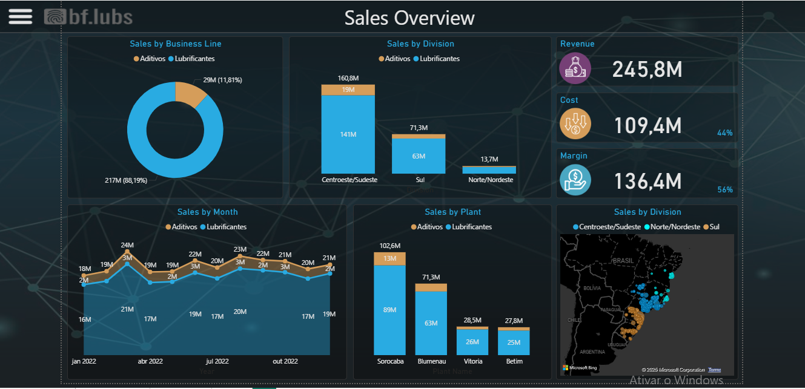

# Course-Projects

**Description:**  
Built during Power BI course with Professor Bruce fonseca. Analyzed sales performance using course dataset.

**Key Insights:**  
- Top-performing products and regions  
- Yearly revenue and margin trends by business line, division, month, and plant. 
- KPIs to track sales performance  

**Screenshot:**  

